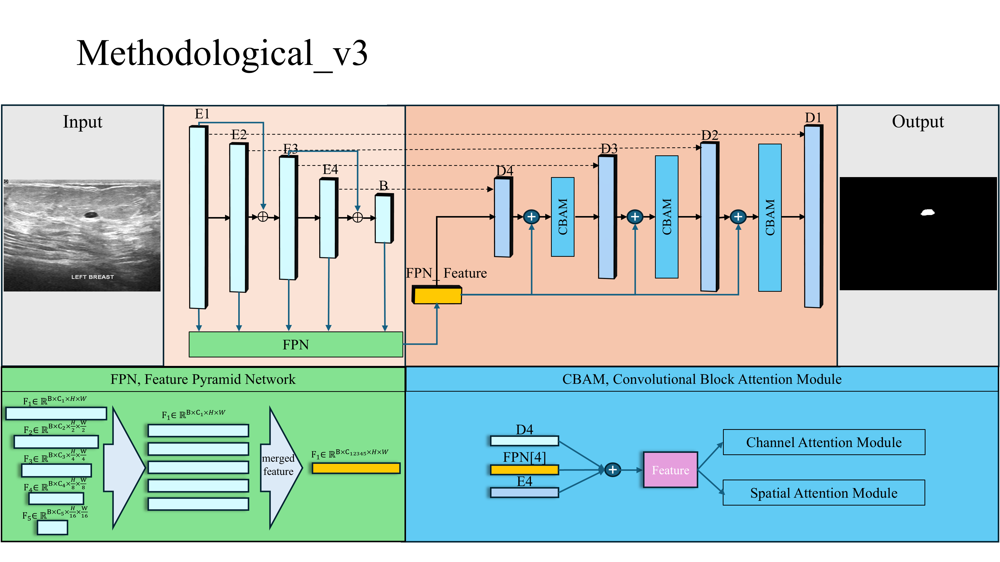

# ICEF: Improved CBAM-Enhanced FPN U-Net

ICEF (Improved CBAM-enhanced FPN U-Net with Residual Blocks) is a medical image segmentation architecture that integrates:

- ✅ Residual U-Net backbone
- ✅ Feature Pyramid Network (FPN) for multi-scale feature fusion
- ✅ CBAM attention (Channel + Spatial)
- ✅ Skip connection via addition (not concatenation)
- ✅ Lightweight and modular design

---

## 🔧 Model Architecture

  

---

## 🧠 Module Overview

| Module        | Description                                                                 |
|---------------|-----------------------------------------------------------------------------|
| `ConvBlock`   | Residual convolutional block with BN + ReLU                                |
| `CBAM`        | Convolutional Block Attention Module (Channel + Spatial Attention)          |
| `TopDownFPN`  | Top-down pathway for multi-level feature refinement                         |
| `Adapters`    | 1×1 convolution for channel alignment during skip connections               |
| `Decoder`     | Upsampling + residual convolution + CBAM                                    |
| `FinalConv`   | 1×1 output convolution to generate segmentation mask                        |

---

## 🏗 Directory Structure

